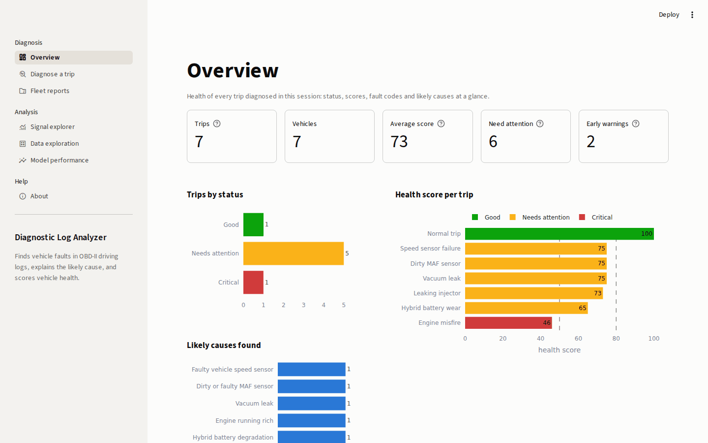
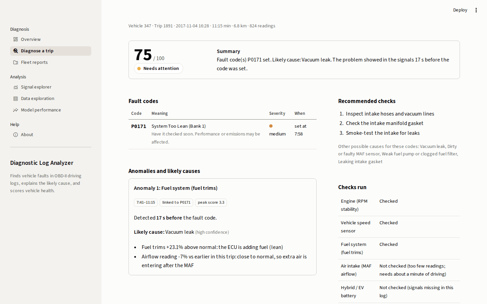
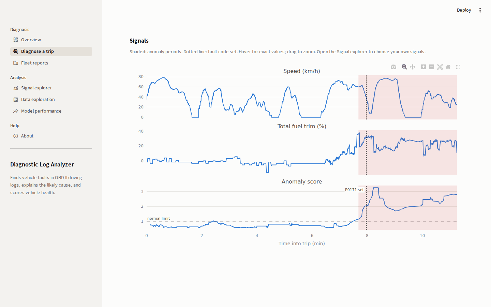
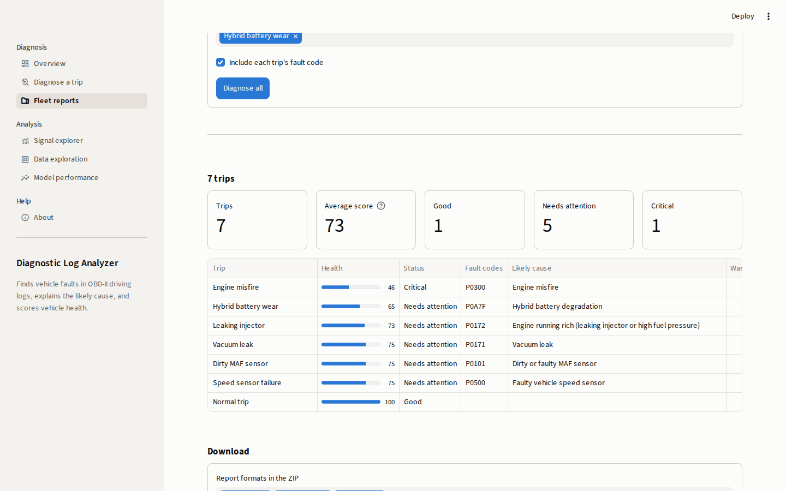
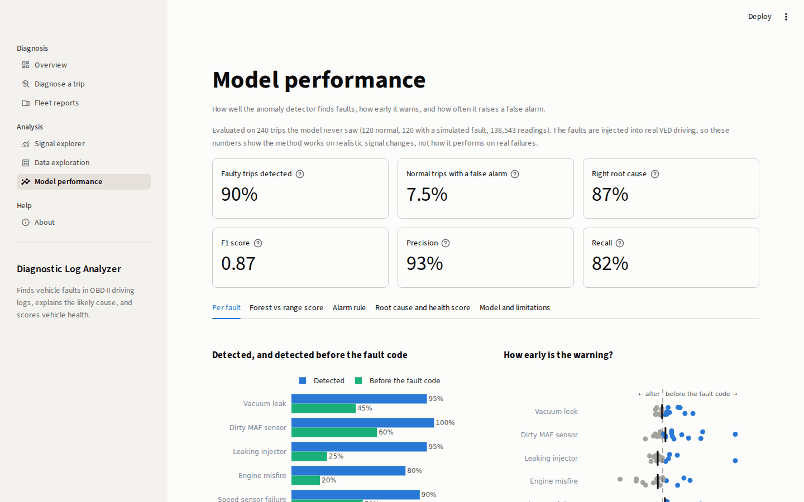
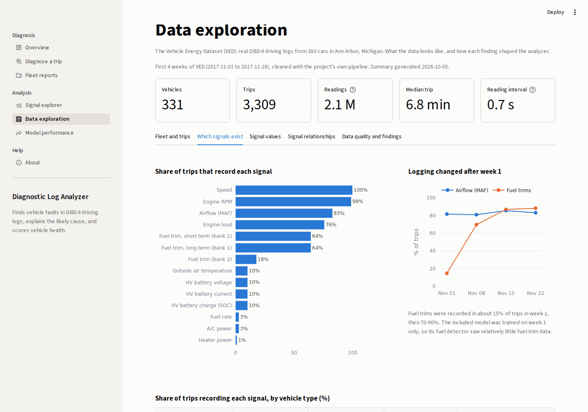
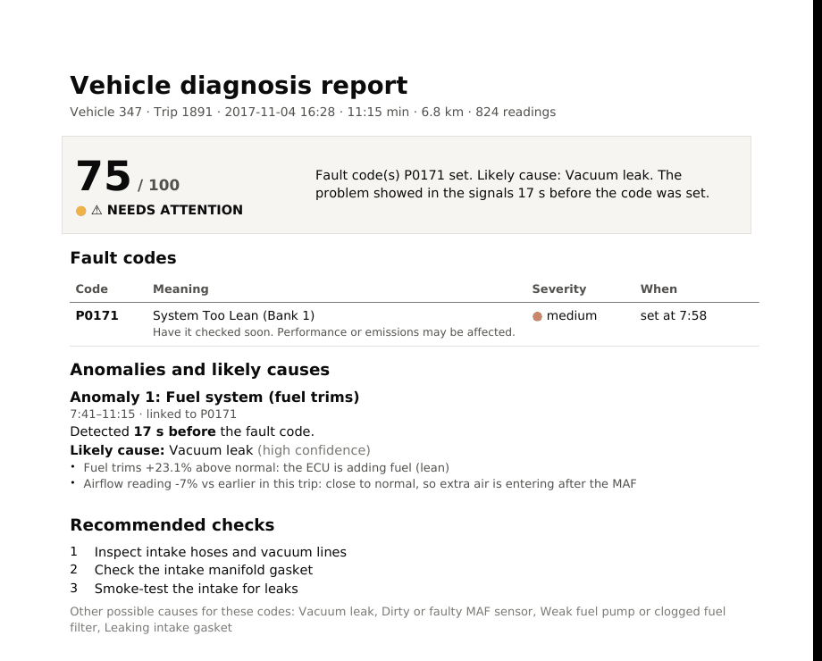

# Automotive Diagnostic Log Analyzer

Machine-learning analyzer for OBD-II driving logs. It detects abnormal sensor behaviour, often before the fault code appears, explains the likely root cause, scores vehicle health, and exports reports as PDF, HTML, JSON or text.



## Results

Tested on 240 unseen trips (120 normal, 120 with simulated faults injected into real VED driving).

| Faulty trips detected | False alarms | Correct root cause | F1 score |
|---|---|---|---|
| **90%** | **7.5%** | **87%** | **0.87** |

| Fault | Detected | Before the fault code | Correct root cause |
|---|---|---|---|
| Vacuum leak (P0171) | 95% | 45% | 84% |
| Dirty MAF sensor (P0101) | 100% | 60% | 65% |
| Leaking injector (P0172) | 95% | 25% | 94% |
| Engine misfire (P0300) | 80% | 20% | 100% |
| Speed sensor failure (P0500) | 90% | 50% | 94% |
| Hybrid battery wear (P0A7F) | 80% | 55% | 88% |

Each subsystem's detector pairs an Isolation Forest with a range score. On its own, the Isolation Forest scores an F1 of 0.61. With the range score added, F1 rises to 0.87.

## Screenshots

| Trip diagnosis | Signals and anomaly period |
|---|---|
|  |  |
| **Fleet reports** | **Model performance** |
|  |  |
| **Data exploration** | **PDF report** |
|  |  |

## Quick start

```bash
git clone https://github.com/OmPatil2806/Automative-Diagnostic--log-analyzer.git
cd Automative-Diagnostic--log-analyzer
pip install -r requirements.txt
streamlit run dashboard/app.py
```

A trained model and sample trips are included. To diagnose a trip from the command line:

```bash
python scripts/run_pipeline.py --log data/samples/vacuum_leak.csv --dtc-file data/samples/vacuum_leak_dtc.csv --format pdf
```

## Data

- [Vehicle Energy Dataset (VED)](https://github.com/gsoh/VED): real OBD-II logs, used to learn normal driving behaviour.
- Synthetic fault logs: six faults injected into VED trips, used to evaluate the analyzer with known labels.

## Tech stack

Python · pandas · scikit-learn · Plotly · Streamlit · ReportLab

## License

MIT
