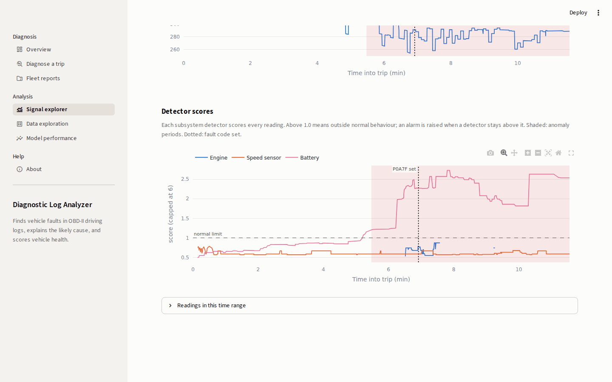
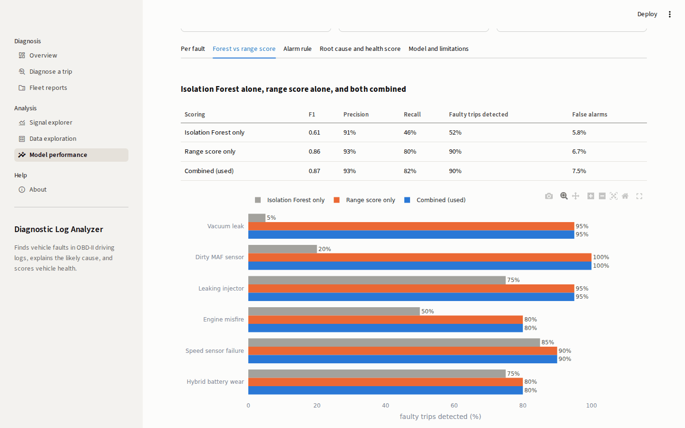

# Automotive Diagnostic Log Analyzer

Machine-learning analyzer for OBD-II driving logs. It finds abnormal sensor behaviour, often before the fault code appears, explains the likely root cause in plain language, scores vehicle health, and produces reports that can be downloaded as PDF, HTML, JSON or text.


## Overview

Vehicles record a lot of diagnostic data, but it is hard to use. A fault code such as `P0171` arrives only after the problem has developed, says little about its cause, and the sensor logs behind it are too large to read by hand. This project turns a raw driving log, plus any fault codes read from the vehicle, into a short diagnosis:

- **Detects anomalies** in each subsystem (engine, vehicle speed sensor, fuel system, air intake, hybrid battery) using models trained on normal driving only
- **Decodes fault codes** into plain English with severity, using a reference table of 64 codes
- **Explains the root cause** from the signals, the way a technician reads live data, so it also works before any code is set
- **Links anomalies to fault codes** and reports how early the problem was visible
- **Scores vehicle health** from 0 to 100 as Good, Needs attention or Critical
- **Generates reports** for one trip or a whole fleet, through a Streamlit dashboard or the command line

## Results

Evaluated on 240 trips the model never saw: 120 normal trips and 120 trips with one of six simulated faults injected into real VED driving.

| Metric | Result |
|---|---|
| Faulty trips detected | **90%** |
| Normal trips with a false alarm | **7.5%** |
| Correct root cause | **87%** |
| Precision / Recall / F1 (reading level) | **93% / 82% / 0.87** |
| Normal trips rated Good | **98%** |

**Per fault**

| Fault | Fault code | Detected | Detected before the fault code | Correct root cause |
|---|---|---|---|---|
| Vacuum leak | P0171 | 95% | 45% | 84% |
| Dirty MAF sensor | P0101 | 100% | 60% | 65% |
| Leaking injector | P0172 | 95% | 25% | 94% |
| Engine misfire | P0300 | 80% | 20% | 100% |
| Speed sensor failure | P0500 | 90% | 50% | 94% |
| Hybrid battery wear | P0A7F | 80% | 55% | 88% |

**Isolation Forest alone is not enough.** It cannot extrapolate: a value far outside the training data scores about the same as the most extreme normal value. Adding a range score, which measures how far each feature is beyond its normal band, raised F1 from 0.61 to 0.87.

| Scoring | F1 | Precision | Recall | Faulty trips detected | False alarms |
|---|---|---|---|---|---|
| Isolation Forest only | 0.61 | 91% | 46% | 52% | 5.8% |
| Range score only | 0.86 | 93% | 80% | 90% | 6.7% |
| **Combined (used)** | **0.87** | **93%** | **82%** | **90%** | **7.5%** |

## Screenshots

**Diagnosis of a single trip**: health score, fault codes, likely cause and recommended checks, with one-click downloads.


**Signals with the anomaly period**: the fuel trims rise and the anomaly score crosses the normal limit 17 seconds before `P0171` is set.


**Fleet reports**: diagnose many trips at once and download every report in one ZIP.


**Signal explorer**: per-subsystem detector scores; here the battery detector catches hybrid battery wear before `P0A7F`.



**Model performance**




**Data exploration** of the VED dataset: 331 vehicles, 3,309 trips, 2.1 million readings.


**PDF report**


## How it works

1. **Ingestion**: load and clean OBD-II logs (VED format or a simple CSV), and remove invalid readings.
2. **Per-vehicle baselines**: learn each vehicle's normal behaviour, including expected airflow for a given RPM and load, expected battery voltage for a given charge and current, and the usual fuel trim level.
3. **Features**: deviations from that baseline over a rolling window, such as fuel trim offset, airflow and voltage residuals, RPM instability at steady speed, and impossible speed jumps.
4. **Detection**: one detector per subsystem combines an Isolation Forest with a range score. An alarm is raised when 70% of the last 30 readings are anomalous.
5. **Diagnosis**: rules on the signal evidence give the likely cause (for example, fuel trims high with normal airflow means a vacuum leak). Anomalies are linked to fault codes to measure the warning time.
6. **Health score**: 100 minus penalties for fault codes (by severity) and for early warnings.
7. **Reporting**: text, JSON, interactive HTML and PDF, for one trip or a fleet.

## Quick start

A trained model and sample trips are included, so no download is needed.

```bash
git clone https://github.com/OmPatil2806/Automative-Diagnostic--log-analyzer.git
cd Automative-Diagnostic--log-analyzer
pip install -r requirements.txt

# Dashboard
streamlit run dashboard/app.py

# Command line
python scripts/run_pipeline.py --log data/samples/vacuum_leak.csv --dtc-file data/samples/vacuum_leak_dtc.csv --format pdf html
```

The input is a CSV with `time_ms`, `speed_kmh` and `engine_rpm`, plus any optional signals: fuel trims, MAF airflow, engine load, and hybrid battery voltage, current and charge. Checks whose signals are missing are skipped, and the report says so. Fault codes can be typed, given as a raw OBD-II response, or provided as a CSV with the time each code was set.

To retrain on the full data:

```bash
python scripts/download_ved.py --weeks 4
python scripts/prepare_ved.py
python scripts/generate_synthetic.py
python scripts/train_model.py
pytest
```

## Data

- **[Vehicle Energy Dataset (VED)](https://github.com/gsoh/VED)**: real OBD-II driving logs from cars in Ann Arbor, Michigan (Apache-2.0). Used to learn normal behaviour.
- **Synthetic fault logs**: six faults injected into real VED trips, each growing gradually and setting its fault code at full strength. Used to test detection and root-cause analysis with known labels.

## Limitations

- The faults are simulated. The results show that the method works on realistic signal changes, not how it performs on real failures.
- VED records about one reading per second, which is too slow to see individual misfires. Misfire is the hardest fault to detect.
- The included model was trained on the first VED week, in which few trips record fuel trims. Training on more weeks should improve the fuel-system detector.

## Notebooks

[Data exploration](notebooks/01_data_exploration.ipynb) · [Synthetic faults](notebooks/02_synthetic_faults.ipynb) · [Anomaly detection](notebooks/03_anomaly_detection.ipynb) · [Diagnosis demo](notebooks/04_diagnosis_demo.ipynb)

## Tech stack

Python · pandas · scikit-learn · Plotly · Streamlit · ReportLab · pytest

## License

MIT
